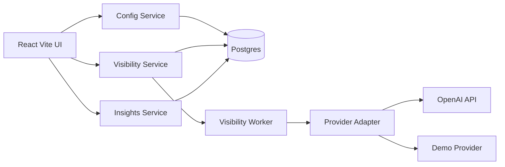
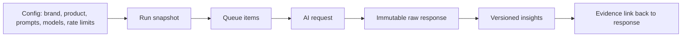

# Brandlight AI Visibility Demo

AI Visibility Demo is an interview-ready product skeleton for showing how an
enterprise brand can measure and explain its visibility inside AI-generated
answers.

The core idea is evidence-first: configuration defines what to measure, the
worker collects raw AI responses asynchronously, and the insights service derives
repeatable metrics that link back to the original raw evidence.

## Architecture



## Evidence Pipeline



## Service Responsibilities

- `config-service` owns brands, products, competitors, prompt versions, provider
  metadata, model registry entries, credentials metadata, and rate-limit policy.
- `visibility-service` owns run batches, queue state, run items, raw requests,
  raw responses, idempotency keys, latency, usage, and model errors.
- `visibility-worker` claims queued items, applies rate-limit policy, calls the
  provider-neutral AI adapter, and writes immutable raw evidence.
- `insights-service` derives versioned mentions, citations, summaries, and
  evidence links from stored raw responses.
- `apps/web` provides the React/Vite demo UI: Config, Queue, Visibility, and
  Insights tabs.

## What The Demo Shows

1. Configure Brandlight, prompt versions, provider metadata, model selection,
   credentials metadata, and per-model rate limits.
2. Create a visibility run that expands prompts across enabled models.
3. Watch queued work move through the visibility worker.
4. Inspect searchable raw AI responses with request JSON, response JSON, usage,
   latency, and idempotency keys.
5. Run deterministic insight extraction and view brand mentions, competitor
   mentions, citation domains, and evidence links.
6. Click an insight evidence link and jump directly back to the raw response that
   supports it.

## Technical Highlights

- Python services with FastAPI, SQLAlchemy, Alembic, Poetry, and Postgres.
- React/Vite frontend with Cypress E2E validation.
- Provider-neutral AI adapter boundary for OpenAI and fake/demo providers.
- UI-configurable prompt versions, provider credentials metadata, model
  enablement, and rate limits.
- Idempotent raw response persistence.
- Versioned deterministic insights linked back to raw evidence.
- OpenSpec and contract-first docs under `openspec/` and `contracts/`.

## Local Setup

Create local runtime settings from the example file:

```powershell
copy .env.example .env
```

Install dependencies:

```powershell
poetry install
cd apps/web
npm install
```

Start the full local stack:

```powershell
poetry run dev
```

Open the UI:

```text
http://127.0.0.1:5173
```

OpenAPI docs:

- Config service: `http://localhost:8001/docs`
- Visibility service: `http://localhost:8002/docs`
- Insights service: `http://localhost:8003/docs`

## Real OpenAI Mode

Real OpenAI execution is opt-in. Set these keys in `.env`:

```dotenv
ENABLE_OPENAI=true
OPENAI_API_KEY=...
```

The key is read by runtime services from `.env`. It is not committed and should
not be passed in command-line history.

## Validation

Useful checks:

```powershell
poetry run precommit
poetry run test-unit
poetry run test-service
poetry run demo-check
poetry run demo-e2e
poetry run web-check
poetry run web-e2e
```

The Cypress flow uses deterministic API intercepts and does not call OpenAI. The
backend smoke flow uses the same worker path as the local demo and can run with
the fake provider or real OpenAI depending on `.env`.

## Demo Guide

The concise walkthrough lives in [docs/demo/demo.md](docs/demo/demo.md).

The architecture decision register lives in
[docs/decisions/architecture.md](docs/decisions/architecture.md).
