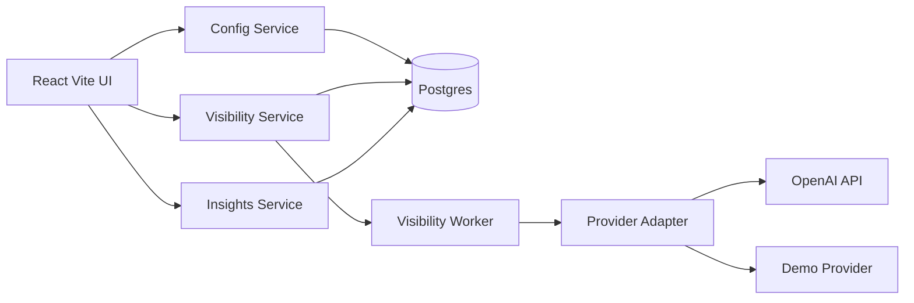
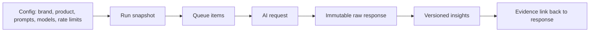
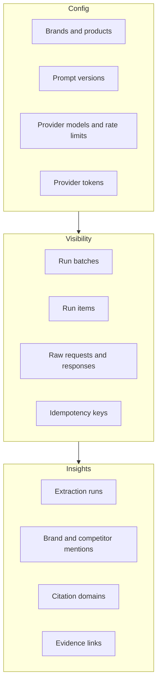
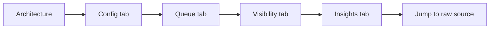

# Brandlight AI Visibility Demo

## System Diagram

## Evidence Pipeline

## Service Boundaries

## Live Demo Flow

## Critical Talking Points

- Config is the source of truth: brands, products, prompts, models, tokens, and rate limits are database configuration, not code constants.
- Visibility is evidence-first: every AI answer is stored as an immutable raw response with request payload, provider metadata, usage, latency, and idempotency key.
- Provider calls are isolated behind one adapter contract, so execution logic does not depend on OpenAI-specific API details.
- Queue execution is async and observable: batches, items, retries, failures, and model status are visible in the UI.
- Insights are derived and versioned: deterministic extraction produces repeatable numbers and links every finding back to raw response evidence.
- OpenSpec was used milestone by milestone to capture intended behavior before implementation.
